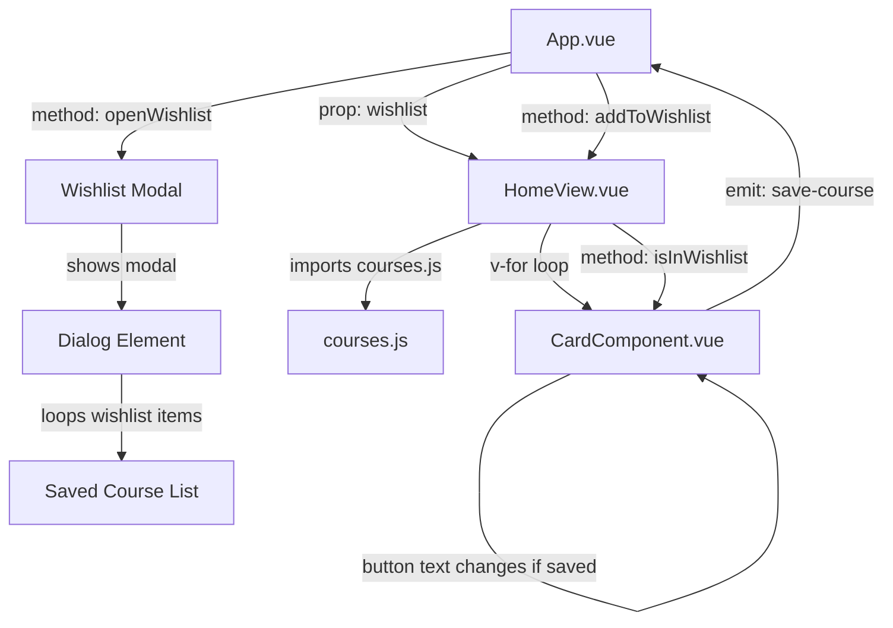

# cooking-masterclass-catalogue

This template should help get you started developing with Vue 3 in Vite.

## Recommended IDE Setup

[VS Code](https://code.visualstudio.com/) + [Vue (Official)](https://marketplace.visualstudio.com/items?itemName=Vue.volar) (and disable Vetur).

## Recommended Browser Setup

- Chromium-based browsers (Chrome, Edge, Brave, etc.):
  - [Vue.js devtools](https://chromewebstore.google.com/detail/vuejs-devtools/nhdogjmejiglipccpnnnanhbledajbpd) 
  - [Turn on Custom Object Formatter in Chrome DevTools](http://bit.ly/object-formatters)
- Firefox:
  - [Vue.js devtools](https://addons.mozilla.org/en-US/firefox/addon/vue-js-devtools/)
  - [Turn on Custom Object Formatter in Firefox DevTools](https://fxdx.dev/firefox-devtools-custom-object-formatters/)

## Customize configuration

See [Vite Configuration Reference](https://vite.dev/config/).


## Project Setup
```sh
git clone <repo-url>
cd <repo>
```

```sh
npm install
```

### Compile and Hot-Reload for Development

```sh
npm run dev
```
## 📌 Project Overview

This project showcases:

- A responsive **Navbar** with a live wishlist counter  
- A **Card component** displaying course data dynamically  
- A **Wishlist modal** using the native `<dialog>` element  
- Global theme colors using **CSS variables**  
- Data file with Course listing  
- Preventing duplicate wishlist entries  
- Save-button state (Added / Save / Sold Out)

The app loads course data from a standalone `courses.js` file and renders them inside `HomeView.vue`.  
When the user saves a course, the item is added to the wishlist stored in `App.vue`.

---

## Diagram

---
##Image


